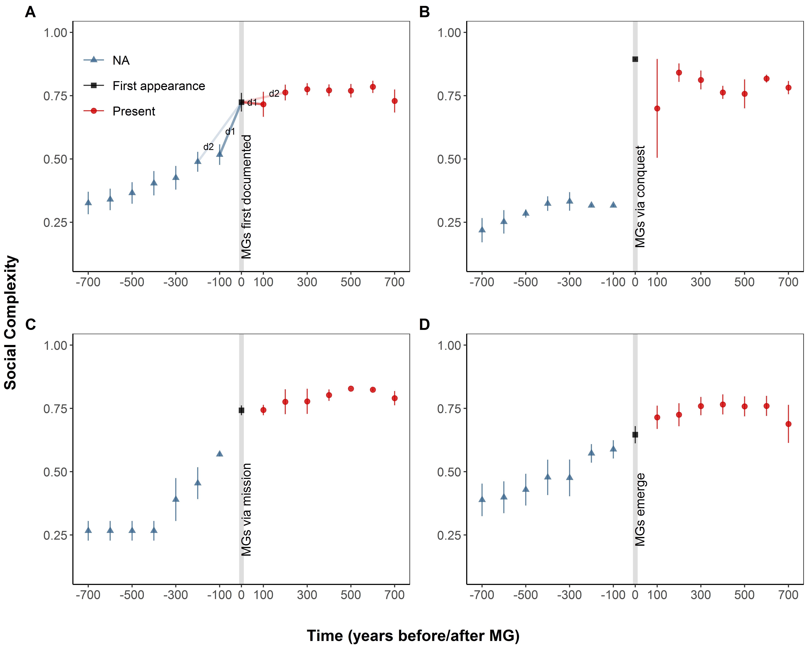
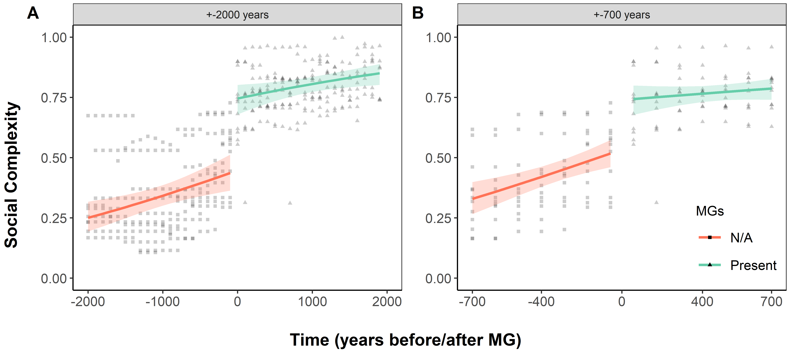

moralizing-gods-reanalysis
============

The following code was based on the analyses in: 

> Whitehouse, H., François, P., Savage, P. E., Currie, T. E., Feeney, K. C., Cioni, E., Purcell, R., Ross, R. M., Larson, J., Baines, J., ter Haar, B., Covey, A., Turchin, P. (2019). Complex societies precede moralizing gods throughout world history. Nature.

This code is derivative modification of [moralizing-gods](https://github.com/pesavage/moralizing-gods) by Patrick Savage and Peter Turchin, used under Creative Commons License [CC BY-NC-SA 4.0](https://creativecommons.org/licenses/by-nc-sa/4.0/), modified and extended by Bret Beheim, Martin Lang and Rachel Spicer under the same license. See LICENSE.md for details.

Steps 1 to 8 are the original analysis code with some minor reorganization, while steps 9 and beyond are extensions and modifications.

## Setup

The code was developed on R v3.5.3 with the following CRAN packages:

- maps (3.3.0)
- plotrix (3.7-4)
- dplyr (0.8.0.1)
- plyr (1.8.4)
- testthat (2.0.1)
- viridis (0.5.1)
- ggplot2 (3.1.1)
- glmmTMB (0.2.3)
- lme4 (1.1-21)
- DHARMa (0.2.4)
- bbmle (1.0.20)
- reshape (0.8.8)
- yarrr (0.1.5)
- effects (4.1-4)
- ggpubr (0.2.2)

Each package can be installed using the `install.packages` command in R.

This code also uses the Stan MCMC engine via the `rstan` package, which requires a C++ compiler.

- rstan (2.18.2) - installation instructions at https://github.com/stan-dev/rstan/wiki/RStan-Getting-Started

There are two additional packages used which are not on CRAN:

- rethinking (1.88) - installation instructions at http://xcelab.net/rm/software/
- glmmADMB (0.8.5) - installation instructions at https://github.com/bbolker/glmmadmb

Each can be installed by using the `devtools` library, following the installation instructions above. For example, to install rethinking, one might type `devtools::install_github("rmcelreath/rethinking")`.

## Running analysis code

To run the primary analyses

1. In R, set the working directory to this folder (e.g. "moralizing-gods-reanalysis") containing the README.md and run_project.r.
2. Type `source("run_project.r")` and hit enter.

If the required packages are installed, the code will run through each module and return the output figures to the `output/` folder. The code is designed to run in sequence, but individual portions can be inspected by the glossary below. Please also note that this script must be run on a computer with administrator access because it creates intermediate subfolders within each step of execution. 

## Reproduction of Whitehouse, et al. Findings

Here the code for specific calculations is highlighted for inspection. Note that to evaluate individual lines in R, one must run all lines up to that particular point. Running lines of script out of order may produce incorrect results.

All project data files are found in `data/`. Seshat database file "exportdat.csv" was scraped on 10 January 2018. Steps 1 to 3 reshape this data and apply a multiple-imputation algorithm to fill in missing predictor values, resulting in `PC1_traj_merged.csv`. This file serves as the primary data source for steps 4 (preparing the t-tests) and 6 (preparing the logistic regression).

t-tests:

- [Calculation of t-test](https://github.com/babeheim/moralizing-gods-reanalysis/blob/master/04_prep_comparisons/prep_comparisons.r#L244)

logistic regressions:

- [Confirmation of 801 cases in design matrix](https://github.com/babeheim/moralizing-gods-reanalysis/blob/master/07_fit_regressions/fit_regressions.r#L23)
- [Regression estimates comparable to Whitehouse, et al.'s Extended Data Table 2](https://github.com/babeheim/moralizing-gods-reanalysis/blob/master/07_fit_regressions/fit_regressions.r#L29-L35)

## Key Findings of Reanalysis, Main Text

Here the code for specific calculations is highlighted for inspection. Note that to evaluate individual lines in R, one must run all lines up to that particular point. Running lines of script out of order may produce incorrect results.

### Missing outcome data replaced with known 0's

- [All missing data ("NA") coded to "0", a.k.a. known absence](https://github.com/babeheim/moralizing-gods-reanalysis/blob/master/06_prep_regression_data/prep_regression_data.r#L48)

- [Confirmation of 490 "NA to 0" missing outcome points in regression dataframe, out of 502 "0"s and 801 total observations](https://github.com/babeheim/moralizing-gods-reanalysis/blob/master/09_explore_data/explore_data.r#L185-L187)

### Table 1 | Moralizing gods across 12 regions in Seshat

Here, a ‘1’ indicates MGs are known to be present in the century-by-century data, ‘0’ that they are known to be absent. An ‘NA’ refers to missing MG data in the authors’ dataset. Only one of the 30 world regions includes a known absence preceding an MG presence (Middle Yellow River Valley, red), data we dispute as miscoded based on expert-generated data (Supplemental S4). Generally, MGs appear in Seshat simultaneously with or after the appearance of writing (green), contra ethnographic records of MGs in non-literate societies (also see Extended Data Figure 1).

[Code](https://github.com/babeheim/moralizing-gods-reanalysis/blob/f7c4d93c8e38c325cde5e66c488e03721df46f03/09_explore_data/explore_data.r#L128-L163)

### Figure 1 | Comparison of Whitehouse et. al.’s model, where missing outcome data (‘NA’) was coded as known absent (‘0’) and a reanalysis removing unknown outcomes

Panel (A) Estimated relationship between the probability of moralizing gods being observed and social complexity, held at average distance and language similarity, fit on original dataset (NA’s recoded as ‘0’s; grey line) and reduced dataset that removed missing values (black line with blue 89% HPDI shading). Mean probabilities of “moralizing gods present” for the 490 historical observations with “unknown” outcome values are given as points: from the original model (grey) and grouped by NGA in revised model (each NGA is assigned a different color). Marked points indicate the “megasociety threshold” outcome probability in both models. Panel (B) Recreation of Whitehouse, et al.’s Fig. 2a, estimating forward bias only from known (non-NA) observations, now showing mean and 95% confidence interval for the predicted first emergence of moralizing gods, approximately 958 (SE: 210) years prior to their first observations in the Seshat database.

Code: 
- [Data for A](https://github.com/babeheim/moralizing-gods-reanalysis/blob/master/13_explore_models/explore_models.r#L116-L189)
- [Data for B](https://github.com/babeheim/moralizing-gods-reanalysis/blob/1abc2406495a5cd681c68a3d15db9fa67b01e00a/13_explore_models/explore_models.r#L507)
- [Original model](https://github.com/babeheim/moralizing-gods-reanalysis/blob/master/12_fit_revised_binomials/fit_revised_binomials.r#L25-L40) ([stan code](https://github.com/babeheim/moralizing-gods-reanalysis/blob/master/12_fit_revised_binomials/stan/original.stan))
- [Revised model](https://github.com/babeheim/moralizing-gods-reanalysis/blob/master/12_fit_revised_binomials/fit_revised_binomials.r#L139-L178) ([stan code](https://github.com/babeheim/moralizing-gods-reanalysis/blob/master/12_fit_revised_binomials/stan/revised.stan))
- [Figure](https://github.com/babeheim/moralizing-gods-reanalysis/blob/1abc2406495a5cd681c68a3d15db9fa67b01e00a/13_explore_models/explore_models.r#L517-L574)

### Extended Data Figure 1 | The first appearance of writing and moralizing gods across NGAs

The solid line indicates when writing and moralizing gods are first recorded in the same century, and the dashed lines show when writing appeared 100 years before moralizing gods and when moralizing gods appeared 100 years before writing. NGAs are colored by whether social complexity data are available both before and after the appearance of moralizing gods or not. Only NGAs with social complexity data available both before and after the appearance of moralizing gods were included in the analysis (and only these NGAs are shown in Table 1). It must be noted that while writing first appears at 2500 BCE in the Kachi Plain, it is absent for the subsequent two polities in the dataset, and does not reappear until 300 BCE - the same time as the first appearance of moralizing gods.

  

[Code](https://github.com/babeheim/moralizing-gods-reanalysis/blob/1abc2406495a5cd681c68a3d15db9fa67b01e00a/09_explore_data/explore_data.r#L15-L97)

### Extended Data Figure 2 | Boxplots (center line, median; box limits, upper and lower quartiles; whiskers, 1.5x interquartile range) & distributions (data points) of “social complexity” score for N = 801 observations, by ‘moralizing gods’ outcome status.

Before statistical analyses were performed in Whitehouse, et al., all “unknown” cases were treated as moralizing gods absent without explicit description in the manuscript.

  

[Code](https://github.com/babeheim/moralizing-gods-reanalysis/blob/1abc2406495a5cd681c68a3d15db9fa67b01e00a/09_explore_data/explore_data.r#L174-L221)

###  Extended Data Figure 3 | Social complexity before and after the appearance of moralizing gods (MGs).

Dots represent mean social complexity as calculated by Whitehouse, et al.1 (a combination of population and territory size, infrastructure, hierarchy, etc. standardized between 0-1) collapsed across NGAs. Bars represent +/- SE. The shading of lines connecting the dots in Figure A reflects the weight that the difference (d1...d7; displayed are only d1 and d2) between the social complexity of time point n and time point 0 receives in the t-test analysis performed by Whitehouse, et al.1 (i.e., differences in social complexity around time 0 are the heaviest, hence driving the forward bias). Note that the increase in social complexity from timepoint -100 to 0 is coded as pre-MG while the complexity often arrives via conquest or mission together with MGs. A. MGs “first appearance” in the archaeo-historical records follows a sharp increase (40%) in social complexity in the 12 geographical areas. B. The sharp increase in social complexity just before the appearance of MGs is partially caused by ascribing properties of conquerors to the conquered regions in the Deccan, Kachi Plain, and Sogdiana regions. C. Similarly, regions receiving MGs via mission (Kansai, Niger Inland Delta, Orkhon Valley) experience a sharp increase in social complexity. D. The remaining six NGAs where MGs were not first recorded through conquest by a larger empire or through mission show a steady rise in social complexity.

  

Code:
- [Extended Data Figure 3](https://github.com/babeheim/moralizing-gods-reanalysis/blob/master/11_fit_hierarchical_models/fit_hierarchical_models.r#L325-L604)

## Key Findings of Reanalysis, Supplementary Material

In observed societies with SC scores less than the median of 0.42, the model estimates moralizing gods will appear in only about 2% of cases (SE: 1%, Fig. 1A) each century.

Code:
- [Fig. 1A](https://github.com/babeheim/moralizing-gods-reanalysis/blob/3fcaf6f1a95a1d1458cadc2e29dab22a8e02c36d/13_explore_models/explore_models.r#L354-L415)

### Figure S1 | Social complexity scores for n = 864 observations in the full Seshat dataset plotted against log-population sizes

Social complexity scores for n = 864 observations in the full Seshat dataset plotted against log-population sizes, with best-fit line (Pearson’s *r* = 0.94) and shading indicating whether the MG outcome variable has known or missing values.

  

Code:

- [Figure](https://github.com/babeheim/moralizing-gods-reanalysis/blob/1abc2406495a5cd681c68a3d15db9fa67b01e00a/09_explore_data/explore_data.r#L269-L283)
- [Pearson's r](https://github.com/babeheim/moralizing-gods-reanalysis/blob/1abc2406495a5cd681c68a3d15db9fa67b01e00a/09_explore_data/explore_data.r#L267)

As illustrated in Extended Data Figure3A, societies increased their complexity on average by 40% within the 100 years just before the appearance of MGs while the average between-century increase in SC for the preceding 700 years was approximately 8%.

Code:
- [Complexity 100 years before appearance of MGs](https://github.com/babeheim/moralizing-gods-reanalysis/blob/1abc2406495a5cd681c68a3d15db9fa67b01e00a/11_fit_hierarchical_models/fit_hierarchical_models.r#L311-L312)
- [Between-century increase in SC for the preceding 700 years](https://github.com/babeheim/moralizing-gods-reanalysis/blob/1abc2406495a5cd681c68a3d15db9fa67b01e00a/11_fit_hierarchical_models/fit_hierarchical_models.r#L314-L319)

However, for 11 out of 12 NGAs, MGs were always detected in Seshat during the first century of the polity’s existence, so any random placing of MGs within the polity time-span would always make the first appearance of MG more recent, i.e. only worsening the forward bias.

Code:
- [Random placing of MGs within polity ](https://github.com/babeheim/moralizing-gods-reanalysis/blob/master/10_test_forward_bias/test_forward_bias.r#L254-L273)

To test the robustness of Whitehouse, et al.1’s results, we performed the same paired t-test analysis as they report in the original text (which we consider inappropriate, see below section S2.2 ‘Growth curve models of social complexity’) but excluded the three NGAs with increases in social complexity due to conquest. For the longest time-span of their data (2000 years Pre and Post-MGs), the results revealed that the five-fold higher rates of social complexity change between Pre- and Post-MGs reported by Whitehouse, et al.1 decreased only to a two-fold higher rate of social complexity change (t = -5.98, df = 141, P < 0.001).

Code:
- [Original paired t-test](https://github.com/babeheim/moralizing-gods-reanalysis/blob/master/04_prep_comparisons/prep_comparisons.r#L144)
- [New paired t-test for unconquered NGAs](https://github.com/babeheim/moralizing-gods-reanalysis/blob/master/10_test_forward_bias/test_forward_bias.r#L277-L445)

Conducting the paired t-test analysis only for the six regions without conquest or mission revealed results congruent with the analysis of the sample comprising all 12 NGAs, but only for the longest time span of these six regions (t = -4.21, df = 111, P < 0.001); when we analyzed the 700 years timespan Pre- and Post-MGs where all NGAs have data (analogous to Whitehouse, et al.1 robustness checks), the results were much weaker (t = -1.34, df = 41, P = 0.188).

Code:
- [New paired t-test for 6 NGAs where MGs emerged for +/2000 years](https://github.com/babeheim/moralizing-gods-reanalysis/blob/master/10_test_forward_bias/test_forward_bias.r#L449-L537)
- [New paired t-test for 6 NGAs where MGs emerged for +/700 years](https://github.com/babeheim/moralizing-gods-reanalysis/blob/master/10_test_forward_bias/test_forward_bias.r#L541-L609)

To examine the effects of possible forward bias, we moved the first appearance of MG at each of the 12 NGAs 100 years back, the smallest possible correction given the resolution of the original data. Using the same analytical techniques as in the original paper, the results of the paired t-test for the longest time span of the data (+/- 2000 years) now shows that MGs positively predict the rise in the rate of social complexity (t = 3.80, df = 201, P < 0.001) -- not a drop in the rate of social complexity as Whitehouse et al.1 find and similar results can be obtained obtained by moving the first MGs appearance 300 years back (t = 6.51, df =203, P < 0.001) and by using the shorter time span of the data (+/- 700 years; see Table S1), indicating that the conclusion about the role of MGs in social complexity increase reached by Whitehouse et al.1 is sensitive to small changes.

Code:
- [100 years forward bias check for +/2000 years](https://github.com/babeheim/moralizing-gods-reanalysis/blob/master/10_test_forward_bias/test_forward_bias.r#L615-L717)
- [300 years forward bias check for +/2000 years](https://github.com/babeheim/moralizing-gods-reanalysis/blob/master/10_test_forward_bias/test_forward_bias.r#L720-L794)
- [100 years forward bias check for +/700 years](https://github.com/babeheim/moralizing-gods-reanalysis/blob/master/10_test_forward_bias/test_forward_bias.r#L963-L1041)
- [300 years forward bias check for +/700 years](https://github.com/babeheim/moralizing-gods-reanalysis/blob/master/10_test_forward_bias/test_forward_bias.r#L1045-L1128)

We therefore performed the same forward bias analysis, but limited the number of NGAs only to the six NGAs where moralizing gods were not recorded through conquest or mission. The results of the forward bias analysis for these 6 NGAs again document the fragility of Whitehouse et al.1’s main conclusion: moving MG appearance 100 years back for the longest time span of the data shows much weaker results (t = -2.73, df = 111, P = 0.007) and these results are no longer significant at conventional levels (P < 0.05) for the 700-year timespan of the data (t = -0.46, df = 41, P = 0.647). Moreover, moving MGs appearance 300 years back again reverses the results reported by Whitehouse et al.1: MGs positively predict the rise in the rate of social complexity both for the longest time span of the data (t = 3.21, df = 111, P = 0.002) and also for the 700-year timespan (t = 2.71, df = 41, P = 0.010). 

Code:
- [100 years forward bias check for +/2000 years](https://github.com/babeheim/moralizing-gods-reanalysis/blob/master/10_test_forward_bias/test_forward_bias.r#L799-L877)
- [300 years forward bias check for +/2000 years](https://github.com/babeheim/moralizing-gods-reanalysis/blob/master/10_test_forward_bias/test_forward_bias.r#L880-L954)
- [100 years forward bias check for +/700 years](https://github.com/babeheim/moralizing-gods-reanalysis/blob/master/10_test_forward_bias/test_forward_bias.r#L1122-L1200)
- [300 years forward bias check for +/700 years](https://github.com/babeheim/moralizing-gods-reanalysis/blob/master/10_test_forward_bias/test_forward_bias.r#L1203-L1277)

The computed rates of SC change included 400 data points (i.e., 200 Pre-MG time-points and 200 Post-MG time-points), but ignored the fact that these data points are nested within 12 focal NGAs from which some NGAs have more observations than others (ranging from 0 to 13 missing centuries per NGA). 

Code:
- [Number of data points](https://github.com/babeheim/moralizing-gods-reanalysis/blob/master/10_test_forward_bias/test_forward_bias.r#L162)
- [Missing data across NGAs](https://github.com/babeheim/moralizing-gods-reanalysis/blob/master/10_test_forward_bias/test_forward_bias.r#L169-L180)

This approach violates the assumption of independence (see p.45) and artificially inflates the degrees of freedom for the t-test. In our view, the data have at least two hierarchical levels corresponding to their nesting within NGAs and their further nesting within world regions. We built a linear mixed model accounting for this nesting structure; however, the goodness-of-fit assessment of this model revealed severe deviation from the normality assumption (see Supplementary R code file 11, lines 744-751 for diagnostic checks and plots, https://github.com/babeheim/moralizing-gods-reanalysis).

Code:
- [Data dependence plot](https://github.com/babeheim/moralizing-gods-reanalysis/blob/master/11_fit_hierarchical_models/fit_hierarchical_models.r#L576-L611)
- [LMM](https://github.com/babeheim/moralizing-gods-reanalysis/blob/master/11_fit_hierarchical_models/fit_hierarchical_models.r#L736)
- [Goodness of fit of LMM](https://github.com/babeheim/moralizing-gods-reanalysis/blob/master/11_fit_hierarchical_models/fit_hierarchical_models.r#L744-L751)

### Table S2 | Estimates with 95% CI from the models of social complexity

Estimates with 95% CI from the models of social complexity. Estimates are raw beta estimates with the logit link. Time is SC change per century. Transformed estimates are plotted in Fig. S2.

Code:
- [Model 1](https://github.com/babeheim/moralizing-gods-reanalysis/blob/master/11_fit_hierarchical_models/fit_hierarchical_models.r#L739-L740)
- [Model 2](https://github.com/babeheim/moralizing-gods-reanalysis/blob/master/11_fit_hierarchical_models/fit_hierarchical_models.r#L894-L895)

Transforming the beta estimates from the logit link revealed that in Model 1, the average estimated rate of SC change per century Pre-MG was 0.01 and Post-MG was 0.006; and in Model 2, the average estimated rate of SC change Pre-MG was 0.03 and Post-MG was 0.007.

Code:
- [Model 1](https://github.com/babeheim/moralizing-gods-reanalysis/blob/master/11_fit_hierarchical_models/fit_hierarchical_models.r#L843)
- [Model 2](https://github.com/babeheim/moralizing-gods-reanalysis/blob/master/11_fit_hierarchical_models/fit_hierarchical_models.r#L999)

### Figure S2 | Estimated regression lines with 95% CI from models in Tab. S2 plotted over scatterplots of raw data.

The two plots differ by the timespan of analyzed data (either 2000 or 700 years Pre- and Post-MGs). Note that 0 on this axis represents widely disparate times, ranging from 2900 BCE to 1100 CE. Also note the sudden jump between Pre- and Post-MG regression lines produced by the way Whitehouse et al. treat conquered NGAs (section S2.1).

  

Code:
- [Figure S3A](https://github.com/babeheim/moralizing-gods-reanalysis/blob/master/11_fit_hierarchical_models/fit_hierarchical_models.r#L881-L946)
- [Figure S3B](https://github.com/babeheim/moralizing-gods-reanalysis/blob/master/11_fit_hierarchical_models/fit_hierarchical_models.r#L1039-L1106)

### Table S3 | Revised logistic regression estimates for the presence or absence of moralizing gods in the reduced dataset

Revised logistic regression estimates for the presence or absence of moralizing gods in the reduced dataset, with means, standard errors, and probability each effect is null or negative (the Type-S sign error). Outcome values coded as “unknown” or “suspected unknown” in the Seshat database and ‘NA’ in the analysis dataset were removed, and to account for within-region non-independence, a varying-effects intercept was added for each NGA. Without NA values converted to 0, lag terms in the original model become linearly dependent with the outcome variable and are removed as well. Social complexity is centered on 0.5 to aid intercept interpretability.

Code:

- [Model](https://github.com/babeheim/moralizing-gods-reanalysis/blob/1abc2406495a5cd681c68a3d15db9fa67b01e00a/12_fit_revised_binomials/fit_revised_binomials.r#L139-L176)([stan code](https://github.com/babeheim/moralizing-gods-reanalysis/blob/master/12_fit_revised_binomials/stan/revised.stan))
- [Table](https://github.com/babeheim/moralizing-gods-reanalysis/blob/1abc2406495a5cd681c68a3d15db9fa67b01e00a/13_explore_models/explore_models.r#L72-L100)

### Figure S4 | Posterior predictions for the probability of moralizing gods present by year

Posterior predictions for the probability of moralizing gods present by year for Whitehouse, et al.’s main 12 NGAs in their analysis, drawn from the model described in Fig. 1A and Table S3 measured in years before their first documented appearance in the Seshat database. Posterior mean probability (black line) accompanied by 89% HPDI (red shading) indicates a high chance of MG presence in every site several centuries before recorded first appearance. Dashed lines indicate the first year at which 80% of posterior mass is above a probability of 0.5 (coin flip), used as a rough estimate of the “first emergence” of moralizing gods in Fig. 1B.

Code:

- [Analysis](https://github.com/babeheim/moralizing-gods-reanalysis/blob/1abc2406495a5cd681c68a3d15db9fa67b01e00a/13_explore_models/explore_models.r#L419-L449)
- [Figure](https://github.com/babeheim/moralizing-gods-reanalysis/blob/1abc2406495a5cd681c68a3d15db9fa67b01e00a/13_explore_models/explore_models.r#L480-L501)

### Figure S5 | Posterior predictions for the probability of moralizing gods present by year 

Posterior predictions for the probability of moralizing gods present by year for Whitehouse, et al.’s main 12 NGAs in their analysis, drawn from their original regression model, measured in years before their first documented appearance in the Seshat database (dashed lines). Posterior mean probability (black line) accompanied by 89% HPDI (red shading) predicts almost no chance of moralizing gods, in contrast to Figure S4.

Code:

- [Analysis](https://github.com/babeheim/moralizing-gods-reanalysis/blob/1abc2406495a5cd681c68a3d15db9fa67b01e00a/13_explore_models/explore_models.r#L419-L449)
- [Figure](https://github.com/babeheim/moralizing-gods-reanalysis/blob/1abc2406495a5cd681c68a3d15db9fa67b01e00a/13_explore_models/explore_models.r#L453-L478)

### Table S4 | Regression estimates for the presence/absence of moralizing gods under three “missingness regimes”

Regression estimates for the presence/absence of moralizing gods under three “missingness regimes” for the 490 missing values: means, standard errors, and posterior probability each effect is null or negative (the Type-S sign error)60. The “Original model” treats all missing values ("NA") as 0, corresponding to the estimates in Whitehouse et al. (‘social complexity’ has been re-centered at 0.5 to improve interpretability). Two alternatives using the same regression model, but different imputation methods for missing values: (1) 96% of NA’s assigned randomly to \`1’ (the frequency of occurrence in the observed data), and (2) 50% of NA’s randomly assigned to \`1’, 50% to \`0’. Social complexity is centered on 0.5 to aid intercept interpretability.

Code: 

- [Original model](https://github.com/babeheim/moralizing-gods-reanalysis/blob/1abc2406495a5cd681c68a3d15db9fa67b01e00a/12_fit_revised_binomials/fit_revised_binomials.r#L25-L40)
- [Alternative model 1](https://github.com/babeheim/moralizing-gods-reanalysis/blob/1abc2406495a5cd681c68a3d15db9fa67b01e00a/12_fit_revised_binomials/fit_revised_binomials.r#L44-L91)
- [Alternative model 2](https://github.com/babeheim/moralizing-gods-reanalysis/blob/1abc2406495a5cd681c68a3d15db9fa67b01e00a/12_fit_revised_binomials/fit_revised_binomials.r#L95-L135)
- [Table](https://github.com/babeheim/moralizing-gods-reanalysis/blob/1abc2406495a5cd681c68a3d15db9fa67b01e00a/13_explore_models/explore_models.r#L11-L68)

### Figure S6 | Estimated relationship between the probability of moral gods being observed and social complexity

Estimated relationship between the probability of moral gods being observed and social complexity, for original model and two alternatives described in Table S4. Trend lines (black) are all held at average distance and language similarity, with 89% HPDI shading. Mean probabilities of “moralizing gods present”, for both “known” and “unknown” outcome values, are given as colored points with 89% HPDI intervals.

Code:
- [Original model](https://github.com/babeheim/moralizing-gods-reanalysis/blob/1abc2406495a5cd681c68a3d15db9fa67b01e00a/12_fit_revised_binomials/fit_revised_binomials.r#L25-L40) ([stan code](https://github.com/babeheim/moralizing-gods-reanalysis/blob/master/12_fit_revised_binomials/stan/original.stan))
- [Alternative model 1](https://github.com/babeheim/moralizing-gods-reanalysis/blob/1abc2406495a5cd681c68a3d15db9fa67b01e00a/12_fit_revised_binomials/fit_revised_binomials.r#L44-L91)
- [Alternative model 2](https://github.com/babeheim/moralizing-gods-reanalysis/blob/1abc2406495a5cd681c68a3d15db9fa67b01e00a/12_fit_revised_binomials/fit_revised_binomials.r#L95-L135)
- [Counterfactual estimates for sc/mg relationship](https://github.com/babeheim/moralizing-gods-reanalysis/blob/1abc2406495a5cd681c68a3d15db9fa67b01e00a/13_explore_models/explore_models.r#L120-L273)
- [Figure](https://github.com/babeheim/moralizing-gods-reanalysis/blob/1abc2406495a5cd681c68a3d15db9fa67b01e00a/13_explore_models/explore_models.r#L277-L351)
