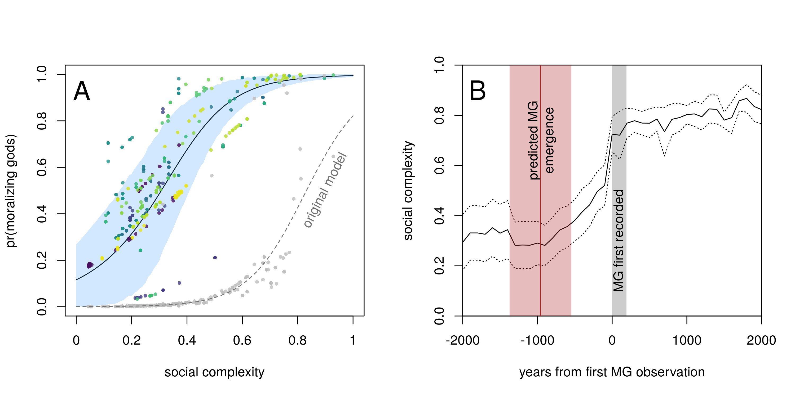
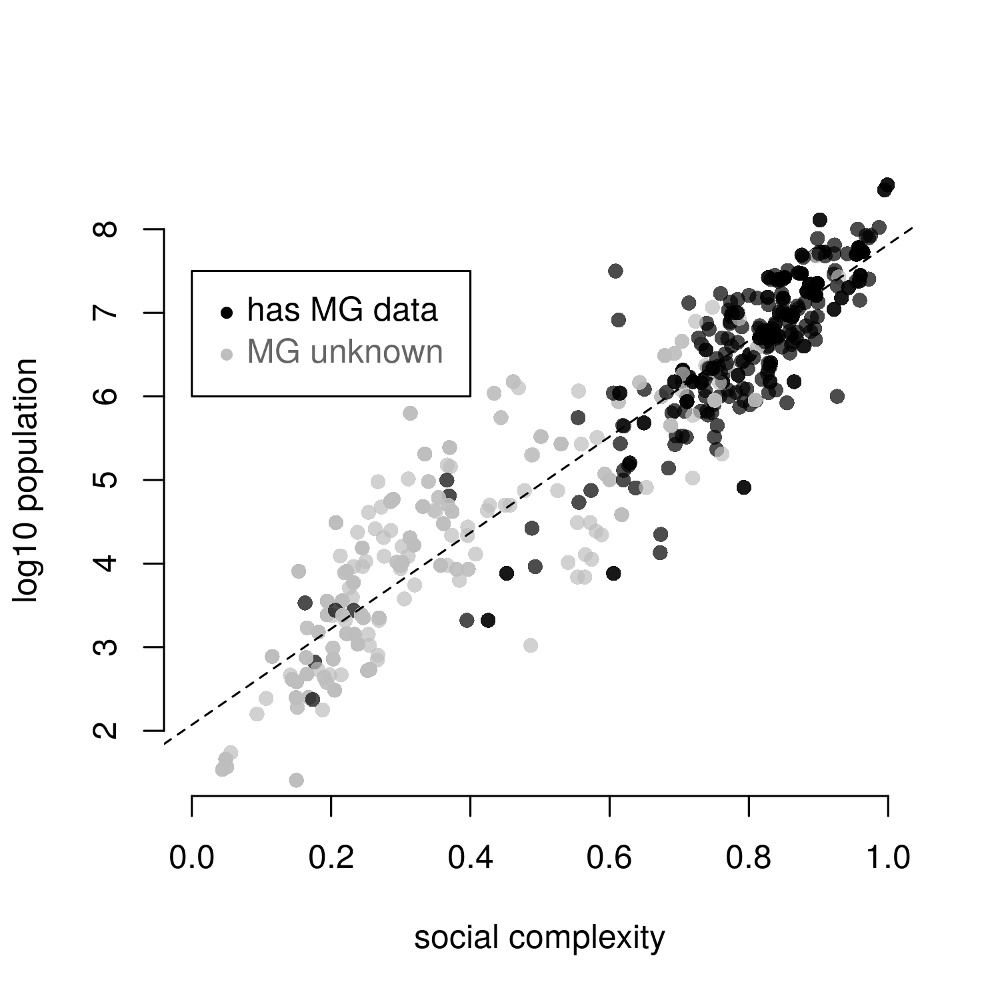

moralizing-gods-reanalysis
============

The following code was based on the analyses in: 

> Whitehouse, H., François, P., Savage, P. E., Currie, T. E., Feeney, K. C., Cioni, E., Purcell, R., Ross, R. M., Larson, J., Baines, J., ter Haar, B., Covey, A., Turchin, P. (2019). Complex societies precede moralizing gods throughout world history. Nature.

This code is derivative modification of [moralizing-gods](https://github.com/pesavage/moralizing-gods) by Patrick Savage and Peter Turchin, used under Creative Commons License [CC BY-NC-SA 4.0](https://creativecommons.org/licenses/by-nc-sa/4.0/), modified and extended by Bret Beheim, Martin Lang and Rachel Spicer under the same license. See LICENSE.md for details.

Steps 1 to 8 are the original analysis code with some minor reorganization, while steps 9 and beyond are extensions and modifications.

## Setup

The code was developed on R v3.5.3 with the following packages for steps 1 to 11:

- maps (3.3.0)
- plotrix (3.7-4)
- dplyr (0.8.0.1)
- plry (1.8.4)
- testthat (2.0.1)
- viridis (0.5.1)
- rstan (2.18.2)
- ggplot (3.1.0)
- rethinking (1.88) - installation instructions at http://xcelab.net/rm/software/

Step 12 was developed with the following additional packages:

- glmmADMB (0.8.5) - installation instructions at https://github.com/bbolker/glmmadmb
- glmmTMB (0.2.3)
- lme4 (1.1-21)
- DHARMa (0.2.4)
- bbmle (1.0.20)
- reshape (0.8.8)
- yarrr (0.1.5)

Step 13 was developed with the following packages:

- dplyr (0.8.0.1)
- ggplot2 (3.1.0.9000)

To run the primary analyses:

1. Set the working directory to "moralizing-gods-reanalysis"
2. In R, type `source("run_project.r")`.

## Reproduction of Whitehouse, et al. Findings

Seshat data file "exportdat.csv" was scraped on 10 January 2018. All other project data files are found in `data/`. Steps 1 to 3 reshape this data and apply a multiple-imputation algorithm to fill in missing predictor values, resulting in `PC1_traj_merged.csv`. This file serves as the primary data source for steps 4 (preparing the t-tests) and 6 (preparing the logistic regression).

t-tests:

- [Calculation of t-test](https://github.com/babeheim/moralizing-gods-reanalysis/blob/master/04_prep_comparisons/prep_comparisons.r#L244)

logistic regressions:

- [Confirmation of 801 cases in design matrix](https://github.com/babeheim/moralizing-gods-reanalysis/blob/master/07_fit_regressions/fit_regressions.r#L23)
- [Regression estimates comparable to Whitehouse, et al.'s Extended Data Table 2](https://github.com/babeheim/moralizing-gods-reanalysis/blob/master/07_fit_regressions/fit_regressions.r#L29-L35)

## Key Findings of Reanalysis, Main Text

### Missing outcome data replaced with 0's

- [All missing data ("NA") coded to "0", a.k.a. known absence](https://github.com/babeheim/moralizing-gods-reanalysis/blob/master/06_prep_regression_data/prep_regression_data.r#L48)

- [Confirmation of 490 "NA to 0" missing outcome points in regression dataframe, out of 502 "0"s and 801 total observations](https://github.com/babeheim/moralizing-gods-reanalysis/blob/master/09_explore_data/explore_data.r#L188-L191)

### Table 1 | Moralizing gods across 12 regions in Seshat

Here, a ‘1’ indicates MGs are known to be present in the century-by-century data, ‘0’ that they are known to be absent. An ‘NA’ refers to missing data in the authors’ data table. MGs only appear in the database simultaneously with or after the appearance of writing (green), despite ethnographic records of many non-literate societies with MGs. Only one of the 30 world regions in Whitehouse, et al. includes a known absence preceding an MG presence (Middle Yellow River Valley, red), a datum we dispute as a miscoding based on expert-generated data (Supplemental S4).

[Code](https://github.com/babeheim/moralizing-gods-reanalysis/blob/master/09_explore_data/explore_data.r#L124-L154)

### Figure 1 | Contrasts between model predictions with imputed data and reanalysis using actual data

Panel (A) Estimated relationship between the probability of MGs being observed and social complexity, held at average distance and language similarity, fit on original dataset (gray line) and reduced dataset removing missing values rather than marking them known 0s (black line with blue 89% HPDI shading). Mean probabilities of “moralizing gods present” for the 490 historical observations with “unknown” outcome values are given as points, from original model (gray points) and grouped by NGA in revised model (colored points). Panel (B) Recreation of Whitehouse, et al.’s Fig. 2, estimating forward bias only from known (non-NA) observations, now showing mean and 95% confidence interval for the predicted first emergence of moralizing gods, approximately 958 (SE: 210) years previous to their first observations in the Seshat database.

Code: 
- [Data for A](https://github.com/babeheim/moralizing-gods-reanalysis/blob/master/13_explore_models/explore_models.r#L328-L391)
- [Data for B](https://github.com/babeheim/moralizing-gods-reanalysis/blob/master/13_explore_models/explore_models.r#L392-425)
- [Original model](https://github.com/babeheim/moralizing-gods-reanalysis/blob/master/12_fit_revised_binomials/fit_revised_binomials.r#L21-L36) ([stan code](https://github.com/babeheim/moralizing-gods-reanalysis/blob/master/12_fit_revised_binomials/stan/original.stan))
- [Revised model](https://github.com/babeheim/moralizing-gods-reanalysis/blob/master/12_fit_revised_binomials/fit_revised_binomials.r#L127-L170) ([stan code](https://github.com/babeheim/moralizing-gods-reanalysis/blob/master/12_fit_revised_binomials/stan/revised.stan))
- [Figure](https://github.com/babeheim/moralizing-gods-reanalysis/blob/master/13_explore_models/explore_models.r#L490-L547)

### Extended Data Figure 1 | The first appearance of writing and moralizing gods across NGAs

The solid line indicates when writing and moralizing gods are first recorded in the same century, and the dashed lines show when writing appeared 100 years before moralizing gods and when moralizing gods appeared 100 years before writing. NGAs are colored by whether social complexity data are available both before and after the appearance of moralizing gods or not. Only NGAs with social complexity data available both before and after the appearance of moralizing gods were included in the analysis (and only these NGAs are shown in Table 1). It must be noted that while writing first appears at 2500 BCE in the Kachi Plain, it is absent for the subsequent two polities in the dataset, and does not reappear until 300 BCE - the same time as the first appearance of moralizing gods. 

  

[Code](https://github.com/babeheim/moralizing-gods-reanalysis/blob/master/09_explore_data/explore_data.R#L13-95)

### Extended Data Figure 2 | Distributions of “social complexity” score for N = 801 observations, by ‘moralizing gods’ outcome status

Before the regression analysis, the authors re-coded the 490 “unknown” cases as “absent” without explicitly documenting this decision. This choice is responsible for their central claimed results. As described in text, societies with “known” and “unknown” outcome data differ dramatically in social complexity, population size and the presence of writing.

  

[Code](https://github.com/babeheim/moralizing-gods-reanalysis/blob/master/09_explore_data/explore_data.r#L171-L222)

### Extended Data Figure 3 | Effect of small corrections to forward bias

Social complexity (SC) before and after the appearance of moralizing gods. Zero on the x-axis represents a standardized appearance of moralizing gods at each NGA per original Whitehouse et al. paper. The grey column illustrates that moralizing gods arrived just after the main rise of SC while the red column illustrates that shifting the arrival of moralizing gods just 100 years (the smallest time unit) earlier would imply that moralizing gods preceded the main SC increase. The blue column displays the first appearance of moralizing gods shifted 300 years earlier. Column width illustrates uncertainty around the time of MG appearance and corresponds to the mean duration of the polity in which MG appeared (after correcting for forward bias). Panel (B) Histograms of the differences in the rates of change in SC Pre-MG minus Post-MG (multiplied by 1000). Y-axes are the number of centuries with a specific rate of SC change (collapsed across the 12 NGAs). The grey histogram is from the original Whitehouse et al. data, while the red and blue histograms shift the first appearance of moralizing gods 100 and 300 years earlier, leading to more positive change in SC after MGs appearance.

  

Code:
- [Panel A for t-100](https://github.com/babeheim/moralizing-gods-reanalysis/blob/master/10_test_forward_bias/test_forward_bias.r#L538-L609)
- [Panel A for t-300](https://github.com/babeheim/moralizing-gods-reanalysis/blob/master/10_test_forward_bias/test_forward_bias.r#L894-L961)
- [Panel B for t-100](https://github.com/babeheim/moralizing-gods-reanalysis/blob/master/10_test_forward_bias/test_forward_bias.r#L612-L648)
- [Panel B for t-300](https://github.com/babeheim/moralizing-gods-reanalysis/blob/master/10_test_forward_bias/test_forward_bias.r#L964-L1001)

## Key Findings of Reanalysis, Supplementary Material

Of the 22 societies observed over 399 cumulative centuries at an SC < 0.4, only 3 are coded with (records of) MGs, and only Hawaii, in the 19th century, with 99,000 people, is coded as having (records of) MGs during the study window.

Code: 

In a hypothetical village of a few dozen people with an SC score of 0, the reported logistic intercept of -7.9 implies a 0.05% (SE: 0.05%) chance of finding broadly moralistic supernatural punishment per century of observation.

Code:

In observed societies with SC scores less than the median of 0.42, the model estimates moralizing gods will appear in only about 2% of cases (SE: 1%, Fig. 1A) each century.

Code:

### Figure S1 | Social complexity scores for n = 864 observations in the full Seshat dataset plotted against log-population sizes

Social complexity scores for n = 864 observations in the full Seshat dataset plotted against log-population sizes, with best-fit line (Pearson’s r = 0.93) and shading indicating whether the MG outcome variable has known or missing values.

  

Code:

- [Figure](https://github.com/babeheim/moralizing-gods-reanalysis/blob/master/09_explore_data/explore_data.r#L253-L279)
- [Pearson's r](https://github.com/babeheim/moralizing-gods-reanalysis/blob/master/09_explore_data/explore_data.r#L261)

Using the same analytical techniques as in the original paper (which we consider inappropriate, see below), the paired t-test now shows that MGs positively predict the rise in the rate of SC (t = 4.04, df = 201, P < 0.001) -- not a drop in the rate of SC as Whitehouse et. al. find.

Code:
- [Original paired t-test](https://github.com/babeheim/moralizing-gods-reanalysis/blob/master/04_prep_comparisons/prep_comparisons.r#L144)
- [New paired t-test for MG-100](https://github.com/babeheim/moralizing-gods-reanalysis/blob/master/10_test_forward_bias/test_forward_bias.r#L301-L373)

Furthermore, moving the first MGs appearance 300 years back (still a very conservative estimate, see Fig. 1B), the rise in the rate of SC change after the appearance of MGs is even stronger (t = 5.48, df = 199, P < 0.001).

Code:
- [New paired t-test for MG-300](https://github.com/babeheim/moralizing-gods-reanalysis/blob/master/10_test_forward_bias/test_forward_bias.r#L659-L731)

However, for 11 out of 12 NGAs, MGs were always detected in Seshat during the first century of the polity’s existence, so any random placing of MGs within the polity time-span would always make the first appearance of MG more recent, i.e. only worsening the forward bias.

Code:
- [Random placing of MGs within polity ](https://github.com/babeheim/moralizing-gods-reanalysis/blob/master/10_test_forward_bias/test_forward_bias.r#L253-L271)

As illustrated in Fig. S2A, societies increased their complexity on average by 39% within the 100 years just before the appearance of MGs while the average between-century increase in SC for the preceding 700 years was approximately 7%.

Code:
- [Complexity 100 years before appearance of MGs](https://github.com/babeheim/moralizing-gods-reanalysis/blob/master/11_fit_hierarchical_models/fit_hierarchical_models.r#L357-L358)
- [Between-century increase in SC for the preceding 700 years](https://github.com/babeheim/moralizing-gods-reanalysis/blob/master/11_fit_hierarchical_models/fit_hierarchical_models.r#L360-L366)

### Figure S2 | Social complexity before and after the appearance of moralizing gods.

Dots represent mean social complexity (SC) collapsed across NGAs. Bars represent +/- SE. The x-axis represents centered time before/after the presumed appearance of MGs at each NGA. Note that 0 on this axis represents widely disparate times, ranging from 2900 BCE to 1100 CE. A. The plot shows that MGs can be detected in the archaeo-historical records just after a sudden jump in social complexity that represents the smallest temporal unit in Whitehouse, et al.’s analysis (one century). B. The sudden jump in social complexity just before the appearance of MGs may be partially explained by the fact that 3 NGAs (Deccan, Kachi Plain, Sogdiana) were coded as having MGs only after these NGAs were integrated into larger empires with millions of inhabitants that already had MGs (upper figure in Panel B). The remaining NGAs (n = 9) that did not explicitly acquire MGs through the conquest of a larger empire (lower figure in Panel B) show a steady rise in social complexity. 

  

Code:
- [Panel A](https://github.com/babeheim/moralizing-gods-reanalysis/blob/master/11_fit_hierarchical_models/fit_hierarchical_models.r#L313-L354)
- [Panel B](https://github.com/babeheim/moralizing-gods-reanalysis/blob/master/11_fit_hierarchical_models/fit_hierarchical_models.r#L370-L450)

To test the robustness of Whitehouse et al.’s results, we also performed the same paired t-test analysis on the reduced sample of nine NGAs that did not acquire MGs via conquest. The results revealed that the five-fold higher rates of SC change between Pre- and Post-MGs reported by Whitehouse et al. decreased only to a two-fold higher rate of SC change (t = -5.28, df = 141, P < 0.001).

Code:
- [New t-test for unconquered NGAs](https://github.com/babeheim/moralizing-gods-reanalysis/blob/master/10_test_forward_bias/test_forward_bias.r#L1029-L1087)
- [Rate of increase change](https://github.com/babeheim/moralizing-gods-reanalysis/blob/master/10_test_forward_bias/test_forward_bias.r#L1089)

Furthermore, correcting the forward bias by 100 years indicates that this result is no longer significant at the conventional alpha levels (t = -0.68, df = 142, P = 0.498) and the correction for 300 years again reverses Whitehouse et al.’s main claim: the Post-MGs rate of SC change is 1.8 the size of the Pre-MG rate of SC change (t = 4.16, df = 143, P < 0.001).

Code:
- [New t-test for unconquered NGAs for MG-100](https://github.com/babeheim/moralizing-gods-reanalysis/blob/master/10_test_forward_bias/test_forward_bias.r#L1099-L1165)
- [New t-test for unconquered NGAs for MG-300](https://github.com/babeheim/moralizing-gods-reanalysis/blob/master/10_test_forward_bias/test_forward_bias.r#1178-L1245)

Note that the degrees of freedom for the t-test analyses in this paragraph differ due to differential rates of available data across the nine NGAs outside the original +/- 2000 years interval (see Supplementary R code).  

Code:
- [Data for MG=0](https://github.com/babeheim/moralizing-gods-reanalysis/blob/master/10_test_forward_bias/test_forward_bias.r#L1095-1096)
- [Data for MG-100](https://github.com/babeheim/moralizing-gods-reanalysis/blob/master/10_test_forward_bias/test_forward_bias.r#L1174-1175)
- [Data for MG-300](https://github.com/babeheim/moralizing-gods-reanalysis/blob/master/10_test_forward_bias/test_forward_bias.r#L1250-1251)

The computed rates of SC change included 400 data points (i.e., 200 Pre-MG time-points and 200 Post-MG time-points), but ignored the fact that these data points are nested within 12 focal NGAs from which some NGAs have more observations than others (ranging from 0 to 13 missing centuries per NGA).

Code:
- [Number of data points](https://github.com/babeheim/moralizing-gods-reanalysis/blob/master/10_test_forward_bias/test_forward_bias.r#L161)
- [Missing data across NGAs](https://github.com/babeheim/moralizing-gods-reanalysis/blob/master/10_test_forward_bias/test_forward_bias.r#L168-179)

This approach severely violates the assumption of independence and artificially inflates the degrees of freedom for the t-test. In our view, the data have at least two hierarchical levels corresponding to their nesting within NGAs and their further nesting within world regions. We built a linear mixed model accounting for this nesting structure; however, the goodness-of-fit assessment of this model revealed severe deviation from the normality assumption (see Supplementary R code for diagnostic checks and plots).

Code:
- [Data dependence plot](https://github.com/babeheim/moralizing-gods-reanalysis/blob/master/11_fit_hierarchical_models/fit_hierarchical_models.r#L530-L560)
- [LMM](https://github.com/babeheim/moralizing-gods-reanalysis/blob/master/11_fit_hierarchical_models/fit_hierarchical_models.r#L586)
- [Goodness of fit of LMM](https://github.com/babeheim/moralizing-gods-reanalysis/blob/master/11_fit_hierarchical_models/fit_hierarchical_models.r#L594-L601)

### Table S1 | Estimates with 95% CI from the models of social complexity

Estimates from beta regressions were back-transformed from the logit link. Time is SC change per millenium. Model “MG 0” is a growth curve model with the appearance of MGs assumed by Whitehouse et al., Model “MG - 300” (MG minus 300) is a growth curve model with shifted MGs’ appearance 300 years back. \*P < 0.05; \*\*\*P < 0.001.

Code:
- [Model MG 0](https://github.com/babeheim/moralizing-gods-reanalysis/blob/master/12_causal_analysis/hierarchical_models.R#L685-686)
- [Model MG -300](https://github.com/babeheim/moralizing-gods-reanalysis/blob/master/12_causal_analysis/hierarchical_models.R#L877-878)

However, when running the same model only for the +/- 700 period (analogous to Whitehouse et al. robustness checks), we found that the Post-MG growth was indeed significantly lower (estimated slope difference per century = -0.0002, 95% CI = (-0.0004, -0.00003)), a result that qualitatively corresponds to the paired t-test Whitehouse et al. report.

Code:
- [Model for +/-700](https://github.com/babeheim/moralizing-gods-reanalysis/blob/master/12_causal_analysis/hierarchical_models.R#L763-764)

We observed a similar interaction trend for MGs shifted only 100 years back, albeit the 95% CI crosses zero (estimated slope difference per millenium = 0.032, 95% CI = (-0.019, 0.082)).

Code:
- [Model MG-100](https://github.com/babeheim/moralizing-gods-reanalysis/blob/master/12_causal_analysis/hierarchical_models.R#L833-834)

### Table S2 | Revised logistic regression estimates for the presence or absence of moralizing gods in the reduced dataset

[Table S2](https://github.com/babeheim/moralizing-gods-reanalysis/blob/master/output/model2.txt)

Revised logistic regression estimates for the presence or absence of moralizing gods in the reduced dataset, with means, standard errors, and probability each effect is null or negative (the Type-S sign error)60. Outcome values coded as “unknown” or “suspected unknown” in the Seshat database and ‘NA’ in the analysis dataset were removed, and to account for within-region non-independence, a varying-effects intercept was added for each NGA. Without NA values converted to 0, lag terms in the original model become linearly dependent with the outcome variable and are removed as well. Social complexity is centered on 0.5 to aid intercept interpretability.

Code:

- [Model](https://github.com/babeheim/moralizing-gods-reanalysis/blob/master/12_fit_revised_binomials/fit_revised_binomials.r#L127-L170)
- [Table](https://github.com/babeheim/moralizing-gods-reanalysis/blob/master/13_explore_models/explore_models.r#L63-L81)

### Figure S5 | Posterior predictions for the probability of moralizing gods present by year

Posterior predictions for the probability of moralizing gods present by year for Whitehouse, et al.’s main 12 NGAs in their analysis, drawn from the model described in Fig. 1A and Table S2 measured in years before their first documented appearance in the Seshat database. Posterior mean probability (black line) accompanied by 89% HPDI (red shading) indicates a high chance of MG present in every site centuries before recorded first appearance. Dashed lines indicate the first year at which 80% of posterior mass is above a probability of 0.5 (coin flip), used as a rough estimate of the “first emergence” of moralizing gods in Fig. 2B.

Code:

- [Analysis](https://github.com/babeheim/moralizing-gods-reanalysis/blob/master/13_explore_models/explore_models.r#L328-L389)
- [Figure](https://github.com/babeheim/moralizing-gods-reanalysis/blob/master/13_explore_models/explore_models.r#L453-L474)

### Table S3 | Regression estimates for the presence/absence of moralizing gods under three “missingness regimes”

[Table S3](https://github.com/babeheim/moralizing-gods-reanalysis/blob/master/output/model1_variations.txt)

Regression estimates for the presence/absence of moralizing gods under three “missingness regimes” for the 490 missing values: means, standard errors, and posterior probability each effect is null or negative (the Type-S sign error)60. The “Original model” treats all missing values (\`NA’) as 0, corresponding to the estimates in Whitehouse et al. (‘social complexity’ has been re-centered at 0.5 to improve interpretability). Two alternatives using the same regression model, but different imputation methods for missing values: (1) 96% of NA’s assigned randomly to \`1’ (the frequency of occurrence in the observed data), and (2) 50% of NA’s randomly assigned to \`1’, 50% to \`0’. Social complexity is centered on 0.5 to aid intercept interpretability.

Code: 

- [Original model](https://github.com/babeheim/moralizing-gods-reanalysis/blob/master/12_fit_revised_binomials/fit_revised_binomials.r#L21-L36)
- [Alternative model 1](https://github.com/babeheim/moralizing-gods-reanalysis/blob/master/12_fit_revised_binomials/fit_revised_binomials.r#L38-L84)
- [Alternative model 2](https://github.com/babeheim/moralizing-gods-reanalysis/blob/master/12_fit_revised_binomials/fit_revised_binomials.r#L86-L125)
- [Table](https://github.com/babeheim/moralizing-gods-reanalysis/blob/master/13_explore_models/explore_models.r#L22-L61)

### Figure S6 | Estimated relationship between the probability of moral gods being observed and social complexity

Estimated relationship between the probability of moral gods being observed and social complexity, for original model and two alternatives described in Table S3. Trend lines (black) are all held at average distance and language similarity, with 89% HPDI shading. Mean probabilities of “moralizing gods present”, for both “known” and “unknown” outcome values, are given as colored points with 89% HPDI intervals.

Code:
- [Original model](https://github.com/babeheim/moralizing-gods-reanalysis/blob/master/12_fit_revised_binomials/fit_revised_binomials.r#L21-L36) ([stan code](https://github.com/babeheim/moralizing-gods-reanalysis/blob/master/12_fit_revised_binomials/stan/original.stan))
- [Alternative model 1](https://github.com/babeheim/moralizing-gods-reanalysis/blob/master/12_fit_revised_binomials/fit_revised_binomials.r#L38-L84)
- [Alternative model 2](https://github.com/babeheim/moralizing-gods-reanalysis/blob/master/12_fit_revised_binomials/fit_revised_binomials.r#L86-L125)
- [Counterfactual estimates for sc/mg relationship](https://github.com/babeheim/moralizing-gods-reanalysis/blob/master/13_explore_models/explore_models.r#L111-L253)
- [Figure](https://github.com/babeheim/moralizing-gods-reanalysis/blob/master/13_explore_models/explore_models.r#L256-L325)
